# MEP
MEP (Mapped Expressions Processor) is an advance 64 bit risc cpu implemented in unimap.

mep is little endian von neumann cpu, it has the features of a regular risc cpu, however it has a wide range of powerfull operations and compound instructions typically found in modern isas.

this document serve as the architectural reference for mep, describing its assembly language, and detailing its instruction encoding.

# execution model
## data types
mep process binary data in littlle endian order, it access bytes and bits from least significant to most significant.

its native word size is 64 bits, the size of the general purpose registers, memory addresses, and the data width of most common operations.

mep supports unsigned and signed twos complement integers at 8, 16, 32 and 64 bits sizes.

## regesters
the majority of instructions operate on general purpose registers (`gpr`). mep provides 31 64 bit general purpose registers named `R1` through `R31`.

these registers can be used freely for any purpose and are accessable to all instructions.

`r0` (the zero register) is a general purpose register that is hardcoded to 0, any read from it will resolve to 0, and all writes are discarded.

`pc` (program counter) is an internal 64 bit register that holds the momery address of the current executing instruction, it is not accessible or modifiable by normal instruction, it is only accessable through special instructions.

### condition registers
mep doesnt have a traditional flagss register, instead all gprs can be used as condition registers.

when evaluated as a condition, zero value is `false`, while non-zero values are `true`.

`r0` used as a condition register redirects to a 1 bit `c0` register, it can hold a condition without overwriting another register.

## memory
memory in mep is byte addressable with 64 bit address space.

all fundamental data types is stored in memory in little endian order and must be aligned to their respective size.

mep is a load store architecture, all memory accesses are performed only by `ld` and `st` instructions.

# assembly language
the assembly language is a human readable form of mep executable code.
## basic syntax
this section uses the [gramex meta language](https://docs.rs/gramex/latest/gramex/docs/gram_ref/index.html), and except the file to be valid utf-8.

whitespace are insignificant, they are only used to separate tokens, the whitespace characters are: space ` `, horizontal tab `\t`, and carriage return `\r`.

line feed `\n` is used as separater between instructions.

#### comments
```gramex
let comment = "//" !"\n"* "\n"? | "/*" !"*/"* "*/";
```
mep assembly supports line and block comments with their respective c style syntax.

they are ignored by the parser, and dont provide any semantic meaning.

#### identifiers
```gramex
let ident = ("a".."z" | "A".."Z") ("a".."z" | "A".."Z" | "0".."9" | "_")*;
```
identifiers are used as name for instructions, registers, labels and constants.

#### numbers
```gramex
let hex_dg = "0".."9" | "a".."f" | "A".."F";
let nb = "0b" ("0" | "1") ("_"? ("0" | "1"))* | "0x" hex_dg ("_"? hex_dg)* | "0".."9" ("_"? "0".."9")*;
```
numbers are unsigned integers used as offsets, immediate and constants.

they can be written in decimal, binary or hexadecimal, with optional `_` as separator for readability.

```
123 0b1001_0101 0xff_AA
```

## top level structure
```gramex
let file = list<label_decl? (inst | const), "\n"+>
```
an assembly file consist of instructions and constants separated by new lines, each instruction or constant can be prefixed with a label.

the assembler encode each instruction and constant into its binary form, then lay them after each other starting at address 0.

```
start: 
	ld.u8 r1, [one]
	mov r2, 2
	add r3, r1, r2

one: u8 0x01;
```

### labels
```gramex
let label_decl = ident ":"
```
labels are used to reference an instruction or constant by name inside immediates and offsets.

they resolve to the offset of the referenced item from the current instruction.

```
data: u32 0x12345678
loop_start: 
	ld.u32 r1, [data]
```

## instructions
```gramex
let mnemonic = list<ident | nb, ".">;
let inst = mnemonic list<oprand, ",">?;
```
an instruction consists of its mnemonic followed by its operands.

instruction mnemonics can be upper or lower case, they are composed of a `.` separated list of identifiers.

each instruction can have 0 or more operands separated by `,`.

```
add r3, r1, r2
```

### instruction decleration
```gramex
let inst_decl = mnemonic ("{" list<"_" | "." (ident | nb), ","> "}")? list<ident "?"? ":" oprand_type, ",">?;
```
instruction declerations found in this document are composed of the intruction mnemonic followed by its operands decleration separated by `,`.

an instruction decleration can declare multiple sub / modified instructions by suffixing the mnemonic with a variant decleration.

the variant decleration is a comma separated list of variant suffixes enclosed inside curly brackets, a suffix can be a `_` (default variant) or a `.` followed by an identifier.

an oprand decleration consist of the oprand identifier followed by its type, an oprand is optional is its identifier is suffixed with `?`.

an instruction mnemonic can be overloaded depending on its operands.

```
add dst:gpr, src1:gpr, src2:u12_imd
comp.eq{_, .and, .or} dst:cond, src1:gpr, src2:gpr
```

### operands
```gramex
let oprand = reg | sh_reg | imd | label | address;
let oprand_type = reg_type | "sh_reg" | imd_type | address_type; 
```
an oprand encodes a storage location, values or options the instruction take / perform on.

oprands come in different forms, they can registers, immediates, memory locations and labels.

```
add r3, r1, r2 shl 3
comp.eq c0, r3, +10
br.true c0, case_1
ld r4, [r1 += 0x10]
```

### register oprands
```gramex
let gpr = "r" ("0".."9" | ("1" | "2") "0".."9" | "30" | "31");
let pc = "pc";
let c0 = "c0";
let reg = gpr | pc | c0;
let reg_type = "gpr" | "cond" | "gpr_pc";
```
register oprands are the most common oprand types, they come in different types:
- `gpr`: any general purpose registers.
- `cond`: register holding a condition, `c0` and any general purpose registers except `r0`.
- `gpr_pc`: `pc` and any general purpose registers except `r0`.

register names can be upper or lower.

```
add r3, R1, r2
comp.eq c0, r1, r2
add r3, pc, +4
```

### shifted register oprands
```gramex
let sh_reg = gpr | gpr ("shl" | "shr" | "sar" | "rol") nb; 
```
shifted register oprands are general purpose registers shifted by a constant encoded in a 6 bit immediate.

the supported shifts are logical left (`shl`), logical right (`shr`), arithmetic right (`sar`), and rotate left (`rol`).

the shift part can be omitted, resulting in `shl 0`.

```
add r3, r1, r2 shl 4
or r4, r1, r3 rol 31
```

### immediate oprands
```gramex
let imd = ("+" | "-")? nb | logic_imd;
let imd_type = 
	"u2_imd" | "u3_imd" | "u6_imd" | "u12_imd" | "u16_imd"
	| "s9_imd" | "s10_imd" | "s12_imd" | "s19_imd" | "s24_imd" 
	| "logic_imd"
;
```
immediate oprands are integer literals that get encoded directly into the instructions.

they can be unsigned or unsigned and of different sizes, the available sizes are:
- for unsigned immediates: 2 bits (`u2_imd`), 3 bits (`u3_imd`), 6 bits (`u6_imd`), 12 bits (`u12_imd`), 16 bits (`u16_imd`).
- for signed immediates: 9 bits (`s9_imd`), 10 bits (`s10_imd`), 12 bits (`s12_imd`), 19 bits (`s19_imd`) and 24 bits (`s24_imd`).

the sign is forbidden for unsigned immediates and required for signed ones.

some immediates (specifically addresses) are scalled by the data width, meaning that the immediate must be multiple of the data width, then the assembler will shift the immediate down before insertion.

```
add r3, r2, 10
comp.eq c0, r3, +10
br +0x14
```

### logic immediate
```gramex
let logic_imd_level = "2" | "4" | "8" | "16" | "32" | "64";
let logic_imd = "logic_imd" "(" (logic_imd_level ",")? nb "," nb ")";
```
logic immediate (`logic_imd`) are specific bitmask immediates for the logical operations.

they are created by the macro `logic_imd(level?, one_len, rot)` that creates a continuous sequence of `1` of len `one_len` from low, then left rotate it by `rot`.

`logic_imd` macro also takes an optional pattern width (`level`, default is `64`) where the pattern get repeated to be fill a 64 bit word.

```
and r3, r1, logic_imd(16, 8) // r3 = r1 & 0xffff00
test.any c0, r3, logic_imd(48, 16) // test 16 bit overflow in r3
```

### label oprands
```gramex
let label = ident;
```
label oprands encode their respective label as an immediate.

they can be used inside any immediate oprand that can fit the label offset.

```
br case_1
ld r1, [data]
```

### address oprands
```gramex
let base_offset = gpr ("+" | "-") "="? nb;
let base_index = gpr | gpr "+" gpr ("shl" nb)?;
let address = "[" (imd | label | base_offset | base_index) "]";
let address_type = "offset" | "base_offset" | "base_index";
```
address oprands encodes a memory address used in loads, stores and branches.

address oprands are composed of an address formula enclosed around square brackets, these formulas can be: 
- **offset**: a scaled immediate or a label.
- **base + offset**: a general purpose register plus a scaled immediate, if the sign is suffixed with `=`, the base register is updated with the computed address afterwards.
- **base + index**: a general purpose register plus an optionally shifted general purpose register.

the offset and shift sizes are determined by each individual instruction. 

```
ld r1, [+0x10]
ld r1, [r2]
ld r1, [r2 + 0x10]
ld r1, [r2 + r3 shl 2]
```

## constants
```gramex
let const = unsigned_nb_const | signed_nb_const | byte_arr_const | str_const;
```
a constant is a value that gets encoded into the binary at the current.

a constant can be put anywhere in the file, and can span any length, however it will be aligned like required.

the assembler will insert padding bytes after a constant to align the next instruction after it.

a constant is composed of its type followed by its value, constant types are:
- **`u8`, `u16`, `u32`, `u64`**: unsigned number.
- **`i8`, `i16`, `i32`, `i64`**: signed number.
- **`bytes`**: byte array.
- **`str`**: string.

### unsigned numbers constants
```gramex
let unsigned_nb_const = ("u8" | "u16" | "u32" | "u64") nb;
```
unsigned numbers constants are unsigned 8, 16, 32 or 64 bits integer literals that get encoded into their binary form.

```
ff: u8 0xff
data: u32 0x12345678
```

### signed numbers constants
```gramex
let signed_nb_const = ("i8" | "i16" | "i32" | "i64") ("-" | "+")? nb;
```
signed numbers constants are signed 8, 16, 32 or 64 bits integer literals that get encoded into their binary form.

```
minus_one: i32 -1
```

### byte array constants
```gramex
let byte_arr_const = "bytes" list<"\n"* nb, ",">;
```
byte array constants are comma separated array of bytes that get encoded in little endian order.

a newline can be used to separate the array into multiple lines, required to have a comma at the end of each line.

```
data: bytes 
	0x01, 0x02, 0x03, 0x04,
	0x05, 0x06, 0x07, 0x08
```

### string constants
```gramex
let escape_code = "\\" ("n" | "r" | "t" | "\"" | "\\" | "x" hex_dg hex_dg | "u{" hex_dg+ "}");
let str_const = "str" "\"" list<escape_code | !"\\"">* "\"";
```
string constants are utf-8 encoded strings that get encoded into their binary form.

strings are double quoted and can have the following escape sequences:
- `\n` newline.
- `\r` carriage return.
- `\t` horizontal tab.
- `\"` double quote.
- `\\` backslash.
- `\xhh` hex encoded character.
- `\u{ccc}` unicode character code.

```
hello: str "hello world"
```

# instruction format
instructions in mep are fixed 32 bit long, composed into multiple fields.

these fields are structured from the least significant bit, and can be opcodes, registers, immediate and options / flags.

### registers
registers are encoded inside 5 bit fields called `gpr` based on their index.

| **register** | **encoding** | **register** | **encoding** | **register** | **encoding** | **register** | **encoding** |
| --------- | ------- | --------- | ------- | --------- | ------- | --------- | ------- |
| **`r0`**  | `00000` | **`r8`**  | `01000` | **`r16`** | `10100` | **`r24`** | `11000` |
| **`r1`**  | `00001` | **`r9`**  | `01001` | **`r17`** | `10101` | **`r25`** | `11001` |
| **`r2`**  | `00010` | **`r10`** | `01010` | **`r18`** | `10110` | **`r26`** | `11010` |
| **`r3`**  | `00011` | **`r11`** | `01011` | **`r19`** | `10111` | **`r27`** | `11011` |
| **`r4`**  | `00100` | **`r12`** | `01100` | **`r20`** | `11000` | **`r28`** | `11100` |
| **`r5`**  | `00101` | **`r13`** | `01101` | **`r21`** | `11001` | **`r29`** | `11101` |
| **`r6`**  | `00110` | **`r14`** | `01110` | **`r22`** | `11010` | **`r30`** | `11110` |
| **`r7`**  | `00111` | **`r15`** | `01111` | **`r23`** | `11011` | **`r31`** | `11111` |

`cond` is a 5 bit field that encodes a register holding a condition, it is simmilar to `gpr` except `c0` replaces `r0`.

`gpr_pc` is a 5 bit field similar to `gpr` execept `pc` replaces `r0`.

### immediates
immediates are encoded directly inside instructions in fields of various sizes.

the immediates fields with their fields are:
- for unsigned immediates: `u2_imd` (2 bits), `u3_imd` (3 bits), `u6_imd` (6 bits), `u12_imd` (12 bits).
- for signed immediates: `s9_imd` (9 bits), `s10_imd` (10 bits), `s12_imd` (12 bits), `s19_imd` (19 bits) and `s24_imd` (24 bits).

signed immediates are encoded in twos complement, and all immediates are contiguous inside the instruction except for `s9_imd` where the sign bit is encoded separately.

some immediates are scaled, the decoder will shift the immediate up to be aligned with the data width before execution.

### shifted register
some instructions take a shifted register oprand, it is encoded in 3 fields: a `gpr` for the register, a `u6_imd` for the shift amount and a `sh` that specifies the shift type.

`sh` is a 2 bit field that can be one of:
- `00`: logical left (`shl`)
- `01`: logical right (`shr`)
- `10`: arithmetic right (`sar`)
- `11`: rotate left (`rol`)

### logic immediate
logic immediates are encoded in 3 fields: `l0` a 1 bit field that specifies the `level`, `ones` a `u6_imd` that encodes `level` and `one_len`,
and `rot` a `u6_imd` that correspond to its macro counterpart.

the concatenation of `l0` and `ones` gives huffman encoding of `level` and `one_len`
| `l0` ~ `ones` | `level` | `one_len` |
| --------- | ---- | -------- |
| `0nnnnnn` | `64` | `nnnnnn` + `1` |
| `10nnnnn` | `32` | `nnnnn` + `1`  |
| `110nnnn` | `16` | `nnnn` + `1`   |
| `1110nnn` | `8`  | `nnn` + `1`    |
| `11110nn` | `4`  | `nn` + `1`     |
| `111110n` | `2`  | `n` + `1`      |

### options
`cw` is a 2 bit field that modifies how a condition is written, it can be:
- **default (`00`)**: overwrite distination register with the computed condition.
- **`.and` (`01`)**: and the computed condition with the distination register condition.
- **`.or` (`11`)**: or the computed condition with the distination register condition.

`ca` is a 1 bit field that modifies how a condition is written, it can be:
- **default (`0`)**: overwrite distination register with the computed condition.
- **`.and` (`1`)**: and the computed condition with the distination register condition.

`sz` is a 2 bit field that specifies the data width, it can be:
- `00`: 64 bit
- `01`: 32 bit
- `10`: 16 bit
- `11`: 8 bit

# arithmatic instructions
## addition
### add (shifted register)
```
add dst:gpr, src1:gpr, src2:sh_reg
```


adds register `src1` and optionally shifted register `src2` and writes the result to `dst` register.

### add (immediate)
```
add dst:gpr, src1:gpr_pc, src2:u12_imd
```
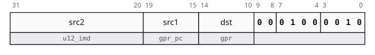

adds register / `pc` (`src1`) and immediate `src2` and writes the result to `dst` register.

### add.carry
```
add.carry dst:gpr, src1:gpr, src2:gpr, carry:cond
```
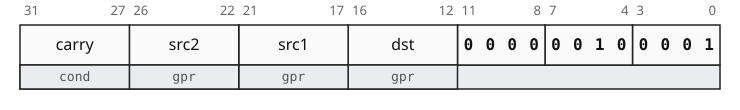

adds registers `src1` and `src2` with carry flag in `carry` register and writes the result to `dst` register, then updates the `carry` register.

### add tripple
```
add dst:gpr, src1:gpr, src2:gpr, src3:gpr
```
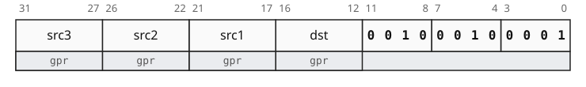

adds registers `src1`, `src2` and `src3` and writes the result to `dst` register.

### cinc
```
cinc dst:gpr, cond:cond, src:gpr
```
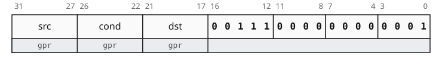

write to `dst` register the `src` register incremented by `1` if `cond` register is `true`, otherwise move `src` without modification.

## subtract
### sub (shifted register)
```
sub dst:gpr, src1:gpr, src2:sh_reg
```


subtracts optionally shifted register `src2` from register `src1` and writes the result to `dst` register.

### sub reverse (shifted register)
```
sub dst:gpr, src1:sh_reg, src2:gpr
```


subtracts register `src2` from optionally shifted register `src1` and writes the result to `dst` register.

### sub (immediate)
```
sub dst:gpr, src1:gpr, src2:u12_imd
```


subtracts immediate `src2` from register `src1` and writes the result to `dst` register.

### sub reverse (immediate)
```
sub dst:gpr, src1:u12_imd, src2:gpr
```
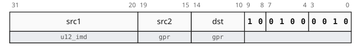

subtracts register `src2` from immediate `src1` and writes the result to `dst` register.

### sub.borrow
```
sub.borrow dst:gpr, src1:gpr, src2:gpr, borrow:cond
```
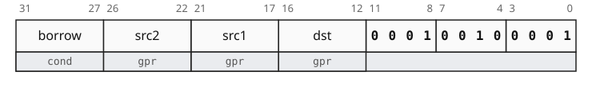

subtracts register `src2` from `src1` with borrow flag in `borrow` register and writes the result to `dst` register, then updates the `borrow` register.

## multiplication
### mult
```
mult dst:gpr, src1:gpr, src2:gpr
```
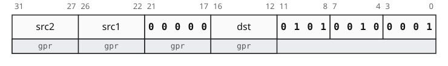

multiplies registers `src1` by `src2` and writes the result to `dst` register.

it is an alias for [`mult.full dst, r0, src1, src2`](#multfull)

### mult.full
```
mult.full plow:gpr, phigh:gpr, src1:gpr, src2:gpr
```
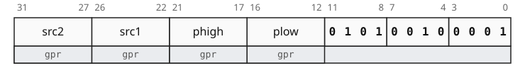

multiplies registers `src1` by `src2` to produce a full 128 bit product, then writes the low and 64 bits to `plow` and `phigh` registers respectively.

### madd
```
madd dst:gpr, src1:gpr, src2:gpr, src3:gpr
```
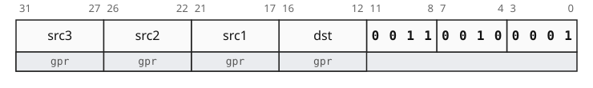

multiplies registers `src1` by `src2` and adds register `src3` to the product and writes the result to `dst` register.

### msub
```
msub dst:gpr, src1:gpr, src2:gpr, src3:gpr
```
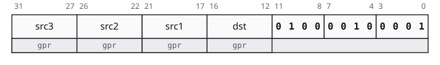

multiplies registers `src1` by `src2` and subtracts the product from register `src3` and writes the result to `dst` register.

## division
### div
```
div dst:gpr, src1:gpr, src2:gpr
```


divides registers `src1` by `src2` and writes the quotient to `dst` register.

it is an alias for [`div.full dst, r0, src1, src2`](#divfull)

### rem
```
rem dst:gpr, src1:gpr, src2:gpr
```


computes the remainder of register `src1` divided by register `src2` and writes the result to `dst` register.

it is an alias for [`div.full r0, dst, src1, src2`](#divfull)

### div.full
```
div.full quo:gpr, rem:gpr, src1:gpr, src2:gpr
```


divides registers `src1` by `src2` then writes the quotient to `quo` register and the remainder to `rem` register.

### udiv
```
udiv dst:gpr, src1:gpr, src2:gpr
```
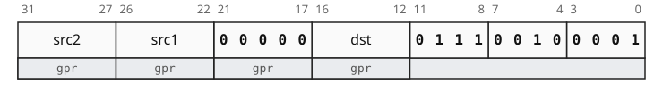

unsigned divide registers `src1` by `src2` and writes the quotient to `dst` register.

it is an alias for [`udiv.full dst, r0, src1, src2`](#udivfull)

### urem
```
urem dst:gpr, src1:gpr, src2:gpr
```
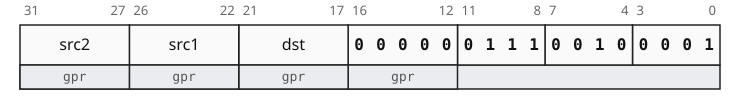

unsigned remainder of register `src1` divided by register `src2` and writes the result to `dst` register.

it is an alias for [`udiv.full r0, dst, src1, src2`](#udivfull)

### udiv.full
```
udiv.full quo:gpr, rem:gpr, src1:gpr, src2:gpr
```
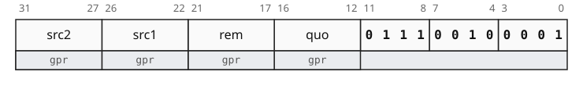

unsigned divide registers `src1` by `src2` then writes the quotient to `quo` register and the remainder to `rem` register.

# sign and comparison instructions
## unary operations
### abs
```
abs dst:gpr, src:gpr
```
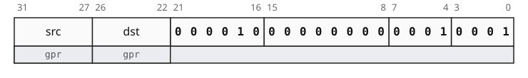

computes the absolute value of register `src` and writes the result to `dst` register.

### neg
```
neg dst:gpr, src:sh_reg
```
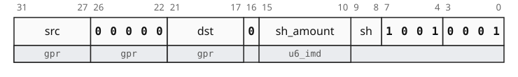

negates an optionally shifted register `src` and writes the result to `dst` register.

it is an alias for [`sub dst, r0, src`](#sub-shifted-register)

### cneg
```
cneg dst:gpr, cond:cond, src:gpr
```
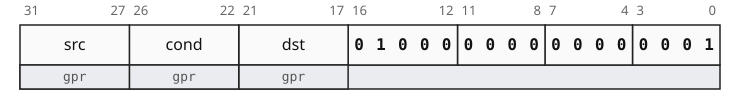

write to `dst` register the negation of `src` register if `cond` register is `true`, otherwise move `src` without modification.

### signed extend
```
se{.8, .16, .32} dst:gpr, src:gpr
```
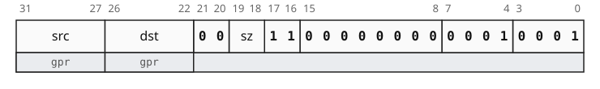

signed extends register `src` to 8, 16 or 32 bits and writes the result to `dst` register.

## min / max
### min
```
min dst:gpr, src1:gpr, src2:gpr
```


determines the signed minimum of registers `src1` and `src2` and writes it to `dst` register.

### max
```
max dst:gpr, src1:gpr, src2:gpr
```


determines the signed maximum of registers `src1` and `src2` and writes it to `dst` register.

### umin
```
umin dst:gpr, src1:gpr, src2:gpr
```
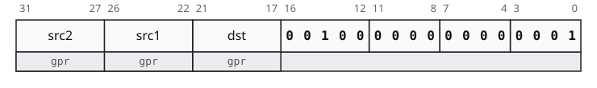

determines the unsigned minimum of registers `src1` and `src2` and writes it to `dst` register.

### umax
```
umax dst:gpr, src1:gpr, src2:gpr
```
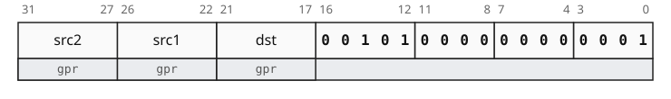

determines the unsigned maximum of registers `src1` and `src2` and writes it to `dst` register.

## equality comparison
### comp.eq
```
comp.eq{_, .and, .or} dst:cond, src1:gpr, src2:gpr
```
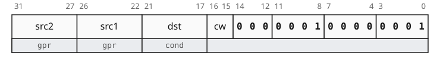

determines if registers `src1` and `src2` are equal and writes the result condition to `dst` register.

this instruction can optionally and / or the computed condition with `dst`.

### comp.ne
```
comp.ne{_, .and, .or} dst:cond, src1:gpr, src2:gpr
```
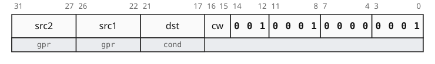

determines if registers `src1` and `src2` are not equal and writes the result condition to `dst` register.

this instruction can optionally and / or the computed condition with `dst`.

### comp.eq immediate
```
comp.eq{_, .and} dst:cond, src1:gpr, src2:s12_imd
```
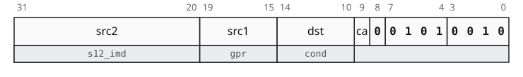

determines if register `src1` is equal to immediate `src2` and writes the result condition to `dst` register.

this instruction can optionally and the computed condition with `dst`.

### comp.ne immediate
```
comp.ne{_, .and} dst:cond, src1:gpr, src2:s12_imd
```


determines if register `src1` is not equal to immediate `src2` and writes the result condition to `dst` register.

this instruction can optionally and the computed condition with `dst`.

## signed comparison
### comp.gt
```
comp.gt{_, .and, .or} dst:cond, src1:gpr, src2:gpr
```
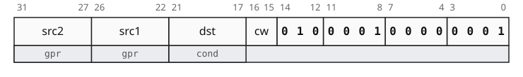

determines if register `src1` is greater than register `src2` and writes the result condition to `dst` register.

this instruction can optionally and / or the computed condition with `dst`.

### comp.le
```
comp.le{_, .and, .or} dst:cond, src1:gpr, src2:gpr
```
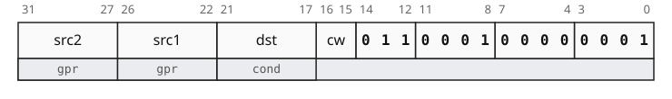

determines if register `src1` is less than or equal to register `src2` and writes the result condition to `dst` register.

this instruction can optionally and / or the computed condition with `dst`.

### comp.gt immediate
```
comp.gt{_, .and} dst:cond, src1:gpr, src2:s12_imd
```


determines if register `src1` is greater than immediate `src2` and writes the result condition to `dst` register.

this instruction can optionally and the computed condition with `dst`.

## unsigned comparison
### ucomp.gt
```
ucomp.gt{_, .and, .or} dst:cond, src1:gpr, src2:gpr
```
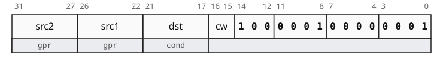

determines if register `src1` is unsignly greater than register `src2` and writes the result condition to `dst` register.

this instruction can optionally and / or the computed condition with `dst`.

### ucomp.le
```
ucomp.le{_, .and, .or} dst:cond, src1:gpr, src2:gpr
```
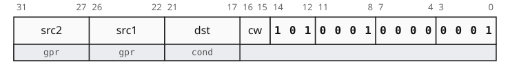

determines if register `src1` is unsignly less than or equal to register `src2` and writes the result condition to `dst` register.

this instruction can optionally and / or the computed condition with `dst`.

### ucomp.gt immediate
```
ucomp.gt{_, .and} dst:cond, src1:gpr, src2:u12_imd
```
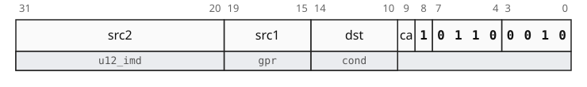

determines if register `src1` is unsignly greater than immediate `src2` and writes the result condition to `dst` register.

this instruction can optionally and the computed condition with `dst`.

# logical instructions
## primary operations
### not (shifted register)
```
not dst:gpr, src:sh_reg
```
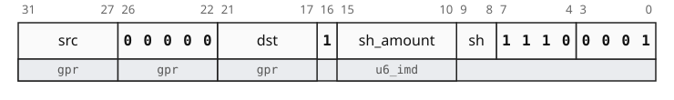

inverts optionally shifted register `src` and writes the result to `dst` register.

it is an alias for [`xnor dst, r0, src`](#xnor-shifted-register).

### cnot
```
cnot dst:gpr, cond:cond, src:reg
```
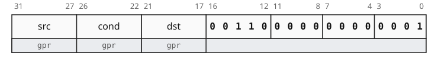

write to `dst` register the inverse of `src` register if `cond` register is `true`, otherwise move `src` without modification.

### and (shifted register)
```
and dst:gpr, src1:gpr, src2:sh_reg
```


computes the bitwise and of register `src1` and optionally shifted register `src2` and writes the result to `dst` register.

### and (immediate)
```
and dst:gpr, src1:gpr, src2:logic_imd
```
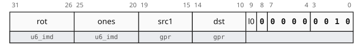

computes the bitwise and of register `src1` and logical immediate `src2` and writes the result to `dst` register.

### or (shifted register)
```
or dst:gpr, src1:gpr, src2:sh_reg
```
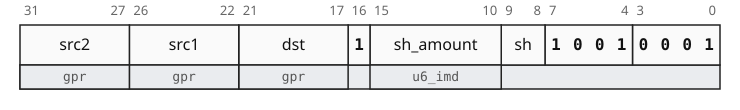

computes the bitwise or of register `src1` and optionally shifted register `src2` and writes the result to `dst` register.

### or (immediate)
```
or dst:gpr, src1:gpr, src2:logic_imd
```


computes the bitwise or of register `src1` and logical immediate `src2` and writes the result to `dst` register.

### xor (shifted register)
```
xor dst:gpr, src1:gpr, src2:sh_reg
```


computes the bitwise exclusive or of register `src1` and optionally shifted register `src2` and writes the result to `dst` register.

### xor (immediate)
```
xor dst:gpr, src1:gpr, src2:logic_imd
```


computes the bitwise exclusive or of register `src1` and logical immediate `src2` and writes the result to `dst` register.

## inverted primary operations
### nand (shifted register)
```
nand dst:gpr, src1:gpr, src2:sh_reg
```


computes the bitwise inverted and of register `src1` and optionally shifted register `src2` and writes the result to `dst` register.

### nand (immediate)
```
nand dst:gpr, src1:gpr, src2:logic_imd
```


computes the bitwise inverted and of register `src1` and logical immediate `src2` and writes the result to `dst` register.

### nor (shifted register)
```
nor dst:gpr, src1:gpr, src2:sh_reg
```


computes the bitwise inverted or of register `src1` and optionally shifted register `src2` and writes the result to `dst` register.

### nor (immediate)
```
nor dst:gpr, src1:gpr, src2:logic_imd
```


computes the bitwise inverted or of register `src1` and logical immediate `src2` and writes the result to `dst` register.

### xnor (shifted register)
```
xnor dst:gpr, src1:gpr, src2:sh_reg
```


computes the bitwise inverted exclusive or of register `src1` and optionally shifted register `src2` and writes the result to `dst` register.

### xnor (immediate)
```
xnor dst:gpr, src1:gpr, src2:logic_imd
```
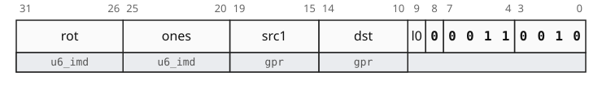

computes the bitwise inverted exclusive or of register `src1` and logical immediate `src2` and writes the result to `dst` register.

## secondary operations
### bit clear (shifted register)
```
bcr dst:gpr, src1:gpr, src2:sh_reg
```


computes the bitwise and of register `src1` and the inverse of optionally shifted register `src2` and writes the result to `dst` register.

### bit clear (immediate)
```
bcr dst:gpr, src1:gpr, src2:logic_imd
```
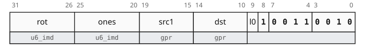

computes the bitwise and of register `src1` and the inverse of logical immediate `src2` and writes the result to `dst` register.

### imply (shifted register)
```
imply dst:gpr, src1:gpr, src2:sh_reg
```
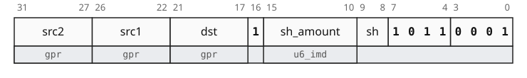

computes the bitwise or of the inverse of register `src1` and optionally shifted register `src2` and writes the result to `dst` register.

### imply (immediate)
```
imply dst:gpr, src1:gpr, src2:logic_imd
```


computes the bitwise or of the inverse of register `src1` and logical immediate `src2` and writes the result to `dst` register.

## bit test
### test.none
```
test.none dst:cond, src:gpr, mask:gpr
```
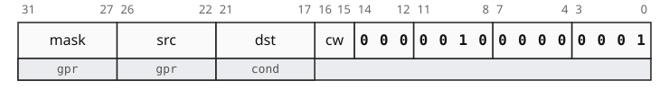

determines if all bits in register `src` specified by register `mask` are zero and writes the result condition to `dst` register.

this instruction can optionally and / or the computed condition with `dst`.

### test.none (immediate)
```
test.none dst:cond, src:gpr, mask:logic_imd
```


determines if all bits in register `src` specified by logical immediate `mask` are zero and writes the result condition to `dst` register.

this instruction can optionally and the computed condition with `dst`.

### test.any
```
test.any dst:cond, src:gpr, mask:gpr
```
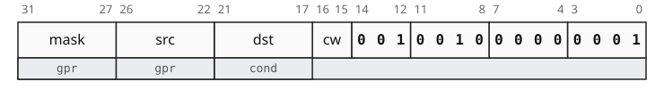

determines if any bit in register `src` specified by register `mask` is one and writes the result condition to `dst` register.

this instruction can optionally and / or the computed condition with `dst`.

### test.any (immediate)
```
test.any dst:cond, src:gpr, mask:logic_imd
```
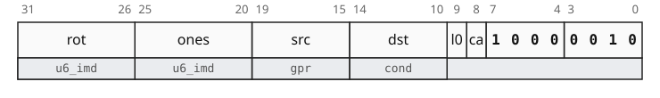

determines if any bit in register `src` specified by logical immediate `mask` is one and writes the result condition to `dst` register.

this instruction can optionally and the computed condition with `dst`.

### test.all
```
test.all dst:cond, src:gpr, mask:gpr
```


determines if all bits in register `src` specified by register `mask` are one and writes the result condition to `dst` register.

this instruction can optionally and / or the computed condition with `dst`.

### test.all (immediate)
```
test.all dst:cond, src:gpr, mask:logic_imd
```


determines if all bits in register `src` specified by logical immediate `mask` are one and writes the result condition to `dst` register.

this instruction can optionally and the computed condition with `dst`.

# bit manipulation instructions
## shifts
### shl
```
shl dst:gpr, src:gpr, amount:gpr
```
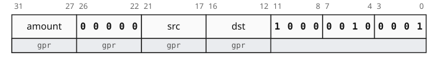

logicaly left shifts register `src` by register `amount` modulo 64 and writes the result to `dst` register.

this is an alias for [`fush dst, src, r0, amount`](#fush).

### shl (immediate)
```
shl dst:gpr, src:gpr, amount:u6_imd
```
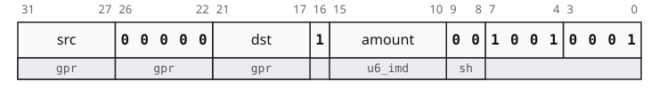

logicaly left shifts register `src` by immediate `amount` and writes the result to `dst` register.

this is an alias for [`or dst, r0, src shl amount`](#or-shifted-register).

### shr
```
shr dst:gpr, src:gpr, amount:gpr
```
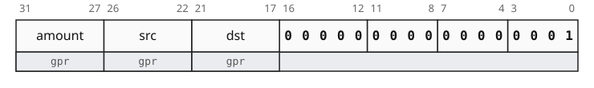

logicaly right shifts register `src` by register `amount` modulo 64 and writes the result to `dst` register.

### shr (immediate)
```
shr dst:gpr, src:gpr, amount:u6_imd
```
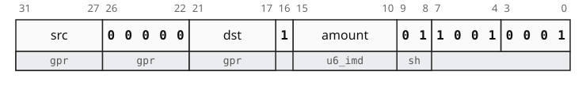

logicaly right shifts register `src` by immediate `amount` and writes the result to `dst` register.

this is an alias for [`or dst, r0, src shr amount`](#or-shifted-register).

### sar
```
sar dst:gpr, src:gpr, amount:gpr
```
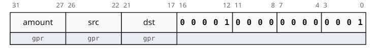

arithmeticly right shifts register `src` by register `amount` modulo 64 and writes the result to `dst` register.

### sar (immediate)
```
sar dst:gpr, src:gpr, amount:u6_imd
```
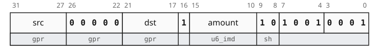

arithmeticly right shifts register `src` by immediate `amount` and writes the result to `dst` register.

this is an alias for [`or dst, r0, src sar amount`](#or-shifted-register).

### rol
```
rol dst:gpr, src:gpr, amount:gpr
```
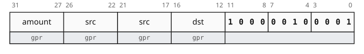

rotate left register `src` by register `amount` modulo 64 and writes the result to `dst` register.

this is an alias for [`fush dst, src, src, amount`](#fush).

### rol (immediate)
```
rol dst:gpr, src:gpr, amount:u6_imd
```
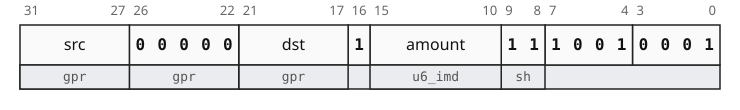

rotate left register `src` by immediate `amount` and writes the result to `dst` register.

this is an alias for [`or dst, r0, src rol amount`](#or-shifted-register).

### fush
```
fush dst:gpr, src:gpr, carry:gpr, amount:gpr
```
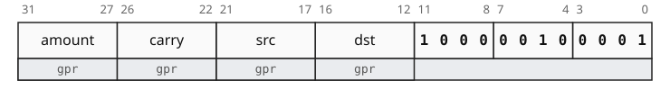

funnel left shift register `src` by register `amount` modulo 64 taking carry from `carry` register and writes the result to `dst` register.

## bitfield
### bfext
```
bfext dst:gpr, src:gpr, offset:gpr, width:gpr
```
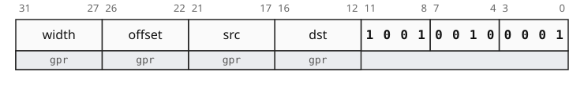

extract from register `src` a bitfield of (register `width` modulo `64` + `1`) bits starting at bit position (register `offset` modulo 64) and writes the result to `dst` register.

### bfext (immediate)
```
bfext dst:gpr, src:gpr, offset:u6_imd, width:u6_imd
```
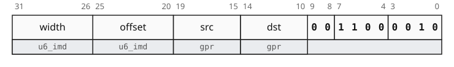

extract from register `src` a bitfield of (immediate `width` + `1`) bits starting at bit position specified by immediate `offset` and writes the result to `dst` register.

### bfins
```
bfins dst:gpr, src:gpr, offset:gpr, width:gpr 
```
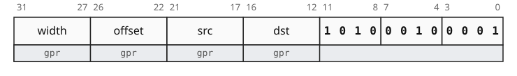

extract from register `src` a bitfield of (register `width` modulo `64` + `1`) bits starting from bit `0` and insert it in register `dst` at bit position (register `offset` modulo 64) without effecting the other bits.

### bfins (immediate)
```
bfins dst:gpr, src:gpr, offset:u6_imd, width:u6_imd
```
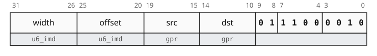

extract from register `src` a bitfield of (immediate `width` modulo `64` + `1`) bits starting from bit `0` and insert it in register `dst` at bit position specified by immediate `offset` without effecting the other bits.

## bit counting
### cnt
```
cnt dst:gpr, src:gpr
```


count the number of `1` bits in register `src` and writes the result to `dst` register.

### cntz
```
cntz dst:gpr, src:gpr
```


count the number of `0` bits in register `src` and writes the result to `dst` register.

### clz
```
clz dst:gpr, src:gpr
```


count the number of leading (most significant) `0` bits in register `src` and writes the result to `dst` register.

### clo
```
clo dst:gpr, src:gpr
```


count the number of leading (most significant) `1` bits in register `src` and writes the result to `dst` register.

### ctz
```
ctz dst:gpr, src:gpr
```


count the number of trailing (least significant) `0` bits in register `src` and writes the result to `dst` register.

### cto
```
cto dst:gpr, src:gpr
```


count the number of trailing (least significant) `1` bits in register `src` and writes the result to `dst` register.

### cls
```
cls dst:gpr, src:gpr
```


count the number of leading (most significant) bits with the same value as bit `63` in register `src` and writes the result to `dst` register.

## reversion
### rev
```
rev dst:gpr, src:gpr
```


reverse the bits in register `src` and writes the result to `dst` register.

### reverse parts
```
rev{.8, .16, .32} dst:gpr, src:gpr
```


reverse the order of 8, 16 or 32 bits parts in register `src` and writes the result to `dst` register.

# data movement instructions
## move
### mov (register)
```
mov dst:gpr, src:gpr
```


move register `src` to `dst` register.

this is an alias for [`or dst, src, r0`](#or-shifted-register).

### mov (immediate)
```
mov dst:gpr, src:u16_imd, sh?: u2_imd
```


write immediate `src` left shifted by (immediate `sh` * `16`) to `dst` register.

### mov (logic immediate)
```
mov dst:gpr, src:logic_imd
```


write the logic immediate `src` to `dst` register.

this is an alias for [`or dst, r0, src`](#or-immediate).

### mov (negative immediate)
```
move dst:gpr, -src:u12_imd
```


write the negative immediate `src` to `dst` register.

this is an alias for [`sub dst, r0, src`](#sub-immediate).

### mov.keep
```
mov.keep dst:gpr, src:u16_imd, sh:u2_imd
```


write immediate `src` into the 16 bit part of `dst` register specified by immediate `sh` without effecting the other bits.

## conditional select
### sel
```
sel dst:gpr, cond:cond, src1:gpr, src2:gpr
```


write to `dst` register the value of register `src1` if `cond` register is `true`, otherwise write the value of register `src2`.

### sel (immediate)
```
sel dst:gpr, cond:cond, src1:gpr, src2:s9_imd
```


write to `dst` register the value of register `src1` if `cond` register is `true`, otherwise write the immediate `src2`.

`src2` is a `s9_imd` where the sign bit is encoded in `s` field.

## mem access (offset)
### ld (offset)
```
ld{_, .32, .16, .8} dst:gpr, loc:offset
```


loads from memory the 64, 32, 16 or 8 bits value at address `loc` and writes the result to `dst` register.

the address is computed a `s19_imd` relative `offset` scaled by data width.

## memory access (base + offset)


the address is computed from a `base` register plus a `s12_imd` `offset` scaled by data width.

if `w` field is `1` the `base` register is updated with the computed address.

### ld (base + offset)
```
ld{_, .32, .16, .8} dst:gpr, loc:base_offset
```


loads from memory the 64, 32, 16 or 8 bits value at address `loc` and writes the result to `dst` register.

### st (base + offset)
```
st{_, .32, .16, .8} src:gpr, loc:base_offset
```


stores the 64, 32, 16 or 8 bits value in `src` register in memory at address `loc`.

### ld.s (base + offset)
```
ld{.s32, .s16, .s8} dst:gpr, loc:base_offset
```


loads from memory the 32, 16 or 8 bits value at address `loc` and writes the signed extended result to `dst` register.

## mem access (base + index)


the address is computed from a `base` register plus an `index` register.

if `s` field is `1`, the `index` register is scaled by data width.

### ld (base + index)
```
ld{_, .32, .16, .8} dst:gpr, loc:base_index
```


loads from memory the 64, 32, 16 or 8 bits value at address `loc` and writes the result to `dst` register.

### st (base + index)
```
st{_, .32, .16, .8} src:gpr, loc:base_index
```


stores the 64, 32, 16 or 8 bits value in `src` register in memory at address `loc`.

### ld.s (base + index)
```
ld{.s32, .s16, .s8} dst:gpr, loc:base_index
```


loads from memory the 32, 16 or 8 bits value at address `loc` and writes the signed extended result to `dst` register.

# control flow instructions
## branches
### br
```
br offset:s24_imd
```


unconditional branch by a `pc` relative `offset` scaled by 4 bytes.

### br (link)
```
br link:gpr, offset:s19_imd
```


stores the address of the next instruction in `link` register then unconditional branch by a `pc` relative `offset` scaled by 4 bytes.

### br (cond)
```
br{.true, .false} cond:cond, offset:s19_imd
```


branch by a `pc` relative `offset` scaled by 4 bytes based on `cond` register.

if `c` field is `1`, branch is taken if `cond` is `true`, otherwise the inverse.

## jumps
### jmp (base + index)
```
jmp link?:gpr, loc:base_index
```


stores the address of the next instruction in `link` register then uncoditional branch to address `loc`.

`loc` is computed from a `base` register plus an `index` register scaled by 4 bytes and further shifted by `sh` field.

### jmp (base + offset)
```
jmp link?:gpr, loc:base_offset
```


stores the address of the next instruction in `link` register then uncoditional branch to address `loc`.

`loc` is computed from a `base` register plus a `s10_imd` `offset` scaled by 4 bytes.

### halt
```
halt
```


halt and end execution without catching on fire.

# index by encoding


| `pgrp` | primary group |
| ------ | --- | 
| `0001` | [`dpr`](#data-processing-register) |
| `0010` | [`dpi`](#data-processing-immediate) |
| `0011` | [`mem`](#memory-1) |
| `0100` | [`branch`](#branch) |

## data processing register


| `grp` | group |
| ------ | --- |
| `0000` | [**3 regs**](#3-regs) |
| `0001` | [**2 regs**](#2-regs) |
| `0010` | [**4 regs**](#4-regs) |
| `1xxx` | [**shift**](#shift) |

### 3 regs
#### format 1


#### format 2


#### format 3


| `sub_grp` | `op` | format | instruction |
| ----- | --- | --- | --- |
| `0000` | `00000` | 1 | [`shr`](#shr) |
| `0000` | `00001` | 1 | [`sar`](#sar) |
| `0000` | `00010` | 1 | [`min`](#min) |
| `0000` | `00011` | 1 | [`max`](#max) |
| `0000` | `00100` | 1 | [`umin`](#umin) |
| `0000` | `00101` | 1 | [`umax`](#umax) |
| `0000` | `00110` | 2 | [`cnot`](#cnot) |
| `0000` | `00111` | 2 | [`cinc`](#cinc) |
| `0000` | `01000` | 2 | [`cneg`](#cneg) |
| `0001` | `000` | 3 | [`comp.eq`](#compeq) |
| `0001` | `001` | 3 | [`comp.ne`](#compne) |
| `0001` | `010` | 3 | [`comp.gt`](#compgt) |
| `0001` | `011` | 3 | [`comp.le`](#comple) |
| `0001` | `100` | 3 | [`ucomp.gt`](#ucompgt) |
| `0001` | `101` | 3 | [`ucomp.le`](#ucomple) |
| `0010` | `000` | 3 | [`test.none`](#testnone) |
| `0010` | `001` | 3 | [`test.any`](#testany) |
| `0010` | `010` | 3 | [`test.all`](#testall) |

| `cw` | modifier |
| --- | --- |
| `00` | default |
| `01` | and |
| `11` | or |

### 2 regs


| `op` | instruction |
| ---- | --- |
| `000000` | [`cnt`](#cnt) |
| `000001` | [`cntz`](#cntz) |
| `000010` | [`abs`](#abs) |
| `000011` | [`cls`](#cls) |
| `000100` | [`clz`](#clz) |
| `000101` | [`clo`](#clo) |
| `000110` | [`ctz`](#ctz) |
| `000111` | [`cto`](#cto) |
| `001000` | [`rev`](#rev) |
| `001001` | [`rev.32`](#reverse-parts) |
| `001010` | [`rev.16`](#reverse-parts) |
| `001011` | [`rev.8`](#reverse-parts) |
| `001101` | [`se.32`](#signed-extend) |
| `001110` | [`se.16`](#signed-extend) |
| `001111` | [`se.8`](#signed-extend) |

### 4 regs
#### format 1


#### format 2


#### format 3


| `op` | format | instruction |
| ---- | --- | --- |
| `0000` | 2 | [`add.carry`](#addcarry) |
| `0001` | 2 | [`sub.borrow`](#subborrow) |
| `0010` | 1 | [`add` tripple](#add-tripple) |
| `0011` | 1 | [`madd`](#madd) |
| `0100` | 1 | [`msub`](#msub) |
| `0101` | 1 | [`mul.full`](#multfull) |
| `0110` | 1 | [`div.full`](#divfull) |
| `0111` | 1 | [`udiv.full`](#udivfull) |
| `1000` | 1 | [`fush`](#fush) |
| `1001` | 1 | [`bfext`](#bfext) |
| `1010` | 1 | [`bfins`](#bfins) |
| `1011` | 3 | [`sel`](#sel) |

### shift


| `o1` | `op2` | instruction |
| --- | --- | --- |
| `0` | `000` | [`add`](#add-shifted-register) |
| `0` | `001` | [`sub`](#sub-shifted-register) |
| `0` | `010` | [`sub` reverse](#sub-reverse-shifted-register) |
| `1` | `000` | [`and`](#and-shifted-register) |
| `1` | `001` | [`or`](#or-shifted-register) |
| `1` | `010` | [`xor`](#xor-shifted-register) |
| `1` | `011` | [`imply`](#imply-shifted-register) |
| `1` | `100` | [`nand`](#nand-shifted-register) |
| `1` | `101` | [`nor`](#nor-shifted-register) |
| `1` | `110` | [`xnor`](#xnor-shifted-register) |
| `1` | `111` | [`bcr`](#bit-clear-shifted-register) |

| `sh` | shift |
| --- | --- |
| `00` | `shl` |
| `01` | `shr` |
| `10` | `sar` |
| `11` | `rol` |

## data processing immediate


| `grp` | group |
| ----- | ------|
| `00xx` | [logic](#logic) |
| `0100` | [arith](#arith) |
| `0101` \| `0110` | [comp](#comp) |
| `0111` \| `1000` \| `1001` | [bit test](#bit-test-1) |
| `1010` | [move wide](#move-wide) |
| `1011` | [`sel`](#sel-immediate) |
| `1100` | [bitfield](#bitfield-1) |

### logic


| `op1` | `o2` | instruction |
| ------| ---- | --- |
| `00` | `0` | [`and`](#and-immediate) |
| `00` | `1` | [`or`](#or-immediate) |
| `01` | `0` | [`xor`](#xor-immediate) |
| `01` | `1` | [`imply`](#imply-immediate) |
| `10` | `0` | [`nand`](#nand-immediate) |
| `10` | `1` | [`nor`](#nor-immediate) |
| `11` | `0` | [`xor`](#xor-immediate) |
| `11` | `1` | [`bcr`](#bcr-immediate) |

### arith


| `op` | instruction |
| ---- | --- |
| `00` | [`add`](#add-immediate) |
| `01` | [`sub`](#sub-immediate) |
| `10` | [`sub` reverse](#sub-reverse-immediate) |

### comp


| `grp` | `op` | instruction | `src2_imd` |
| ----- | ---- | --- | --- |
| `0101` | `0` | [`comp.eq`](#compeq-immediate) | `s12_imd` |
| `0101` | `1` | [`comp.ne`](#compne-immediate) | `s12_imd` |
| `0110` | `0` | [`comp.gt`](#compgt-immediate) | `s12_imd` |
| `0110` | `1` | [`ucomp.gt`](#ucompgt-immediate) | `u12_imd` |

| `ca` | modifier |
| --- | --- |
| `0` | default |
| `1` | and |

### bit test


| `grp` | instruction |
| ----- | --- |
| `0111` | [`test.none`](#testnone-immediate) |
| `1000` | [`test.any`](#testany-immediate) |
| `1001` | [`test.all`](#testall-immediate) |

| `ca` | modifier |
| --- | --- |
| `0` | default |
| `1` | and |

### move wide


| `op` | instruction |
| ---- | --- |
| `0` | [`mov` wide](#mov-immediate) |
| `1` | [`mov.keep`](#movkeep) |

### bitfield


| `op` | instruction |
| ---- | --- |
| `00` | [`bfext`](#bfext-immediate) |
| `01` | [`bfins`](#bfins-immediate) |

## memory


| `amod` | addressing mode |
| ------ | --- |
| `0x` | [base + offset](#base--offset) |
| `10` | [base + index](#base--index) |
| `11` | [`ld` offset](#ld-offset) |

### base + offset


| `op` | instruction |
| ---- | --- |
| `00` | [`ld`](#ld-base--offset) |
| `01` | [`st`](#st-base--offset) |
| `10` | [`ld.s`](#lds-base--offset) |

| `w` | modifier |
| --- | --- |
| `0` | default |
| `1` | write back |

### base + index


| `op` | instruction |
| ---- | --- |
| `00` | [`ld`](#ld-base--index) |
| `01` | [`st`](#st-base--index) |
| `10` | [`ld.s`](#lds-base--index) |

| `s` | modifier |
| --- | --- |
| `0` | no scale |
| `1` | scale |

## branch


| `op1` | `op2` | instruction |
| ----- | ---- | --- |
| `0000` | `_` | [`br`](#br) |
| `0001` | `_` | [`br` link](#br-link) |
| `001x` | `_` | [`br.cond`](#br-cond) |
| `0100` | `0000` | [`jmp` base + index](#jmp-base--index) |
| `0100` | `0001` | [`jmp` base + offset](#jmp-base--offset) |